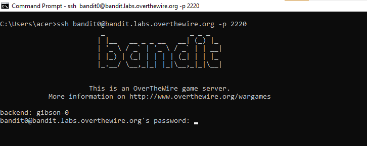
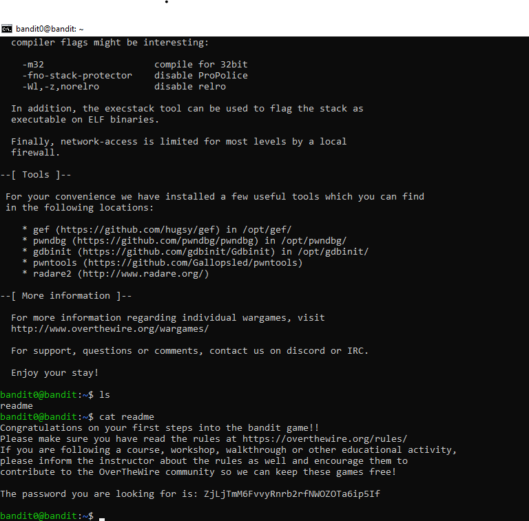

# Bandit Level 0 to Level 1 Walkthrough | OverTheWire Bandit

This walkthrough explains how to solve **OverTheWire Bandit Level 0 to Level 1**.
Bandit is a beginner-friendly Linux wargame designed to teach SSH usage, basic Linux commands, and file handling concepts.

This guide is useful for:
- Linux beginners
- CEH and cybersecurity students
- Anyone starting the OverTheWire Bandit wargame

---

## Bandit Level 0 → Level 1

### Goal
Login to the Bandit server and retrieve the password stored in a file.

### Credentials
- **Username:** bandit0  
- **Password:** bandit0  

### SSH Command
```bash
ssh bandit0@bandit.labs.overthewire.org -p 2220


## Solution StepsStep 1: Connect to the Bandit Server
1.Use SSH to connect to the Bandit Level 0 server using the following command:
- ssh bandit0@bandit.labs.overthewire.org -p 2220



2.List Files in the Home Directory
After successfully logging in, list the files in the home directory
- ls
4. A file named `readme` is present.
5.Read the Password File

Display the contents of the readme file using the cat command:
- cat readme


6. And here we get the password for bandit 1 - [ The password you are looking for is: ZjLjTmM6FvvyRnrb2rfNWOZOTa6ip5If ]

## References
- OverTheWire Bandit: https://overthewire.org/wargames/bandit/

## Author 
- https://github.com/Naveen-crypt
- https://tryhackme.com/p/Roxxy47
- https://www.linkedin.com/in/naveenkumbhare
- https://medium.com/@naveenkumbhare
